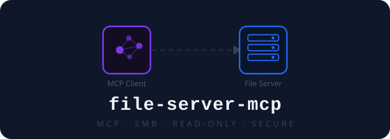
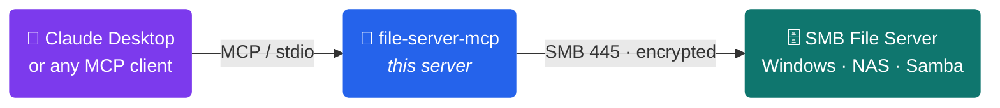

<p align="center">
  
</p>

# remote-file-server-mcp

> **Give any AI assistant read access to your SMB/CIFS file shares — securely, in minutes.**

[](https://github.com/nithiin7/remote-file-server-mcp/actions/workflows/ci.yml)
[](https://www.python.org/)
[](LICENSE)
[](https://modelcontextprotocol.io)

---

## What is this?

An [MCP (Model Context Protocol)](https://modelcontextprotocol.io) server that bridges **Claude Desktop** (or any MCP client) to your **SMB/CIFS network share** — Windows file servers, NAS drives, Samba shares, anything SMB.

Ask Claude to read reports, search through spreadsheets, or summarize documents that live on your network — without moving a single file, pasting credentials into a chat, or granting write access.



---

## Features at a glance

| | |
|---|---|
| **Read-only by design** | The server exposes zero write operations — your files are safe |
| **Credentials stay local** | Passed as env vars, never appear in tool calls or chat history |
| **SMB encryption & signing** | Packet signing on by default; full end-to-end encryption available |
| **Path traversal blocked** | `..` segments are rejected before any SMB call is made |
| **Sensitive file denylist** | `.env`, `*.key`, `*.pem`, `id_rsa`, keystores, and more are never listed or read |
| **Audit log** | Every tool call (operation · path · outcome · size) written as JSON — never file contents |
| **Office & PDF parsing** | Excel, Word, PowerPoint, and PDF files are parsed into readable text automatically |
| **Subdirectory allowlist** | Lock the server to only the directories the model actually needs |

---

## Tools

| Tool | Arguments | Description |
|---|---|---|
| `list_files` | `path` (optional) | List files and directories. Empty path = share root. Returns JSON. |
| `read_file` | `path` | Return text contents. Oversized files return a preview or hard-error. Office/PDF files are parsed. |
| `get_file_info` | `path` | Return metadata (size, type, timestamps) without reading the file. |
| `search_files` | `pattern`, `path` (optional), `max_depth` (optional) | Glob search (e.g. `*.csv`). Recurses up to `max_depth` (default `5`, max `10`), returns up to 200 matches. |

All paths are relative to the share root — e.g. `reports/2024/q1.xlsx`.

---

## Quickstart

### Option A — pip install

```bash
pip install -e /path/to/remote-file-server
```

Then use `"command": "file-server-mcp"` in your MCP client config.

### Option B — uv (no install needed)

```bash
uv run --directory /path/to/remote-file-server file-server-mcp
```

### Option C — run from source

```bash
python3 -m venv .venv && source .venv/bin/activate
pip install -r requirements.txt
python server.py
```

### Option D — Docker

```bash
docker build -t file-server-mcp .
```

See `Dockerfile` for runtime usage.

---

## MCP Client Configuration

Add an entry under `mcpServers` in your client config file.

**uv (run from source, no prior install):**

```json
{
  "mcpServers": {
    "file-server": {
      "command": "uv",
      "args": ["run", "--directory", "/path/to/remote-file-server", "file-server-mcp"],
      "env": {
        "SMB_HOST": "192.168.1.100",
        "SMB_SHARE": "my_share",
        "SMB_USERNAME": "my_user",
        "SMB_PASSWORD": "my_password"
      }
    }
  }
}
```

**pip/uv pip (console script entry point):**

```json
{
  "mcpServers": {
    "file-server": {
      "command": "file-server-mcp",
      "env": {
        "SMB_HOST": "192.168.1.100",
        "SMB_SHARE": "my_share",
        "SMB_USERNAME": "my_user",
        "SMB_PASSWORD": "my_password",
        "SMB_PORT": "445",
        "ALLOWED_PATHS": "reports,finance",
        "AUDIT_LOG_PATH": "/var/log/file-server-mcp/audit.jsonl"
      }
    }
  }
}
```

> **Security note:** This config file contains credentials — restrict its permissions (`chmod 600` on macOS/Linux).

Restart your MCP client after saving.

### Connecting to multiple servers

```json
{
  "mcpServers": {
    "file-server-prod": {
      "command": "file-server-mcp",
      "env": { "SMB_HOST": "10.0.0.10", "SMB_SHARE": "Production", "...": "..." }
    },
    "file-server-dev": {
      "command": "file-server-mcp",
      "env": { "SMB_HOST": "10.0.0.20", "SMB_SHARE": "Development", "...": "..." }
    }
  }
}
```

---

## Environment Variables

| Variable | Required | Default | Description |
|---|---|---|---|
| `SMB_HOST` | Yes | — | IP address or hostname of the SMB server |
| `SMB_SHARE` | Yes | — | Share name on the server |
| `SMB_USERNAME` | Yes | — | Username for SMB authentication |
| `SMB_PASSWORD` | Yes | — | Password for SMB authentication |
| `SMB_PORT` | No | `445` | SMB port |
| `SMB_ENCRYPT` | No | `true` | Set to `false` to disable SMB encryption (not recommended) |
| `SMB_TIMEOUT` | No | `30` | Seconds before an SMB connect or operation times out |
| `MAX_FILE_SIZE_MB` | No | `10` | Maximum file size in MB that `read_file` will read |
| `READ_PREVIEW_LINES` | No | `100` | Lines to return for oversized files. Set to `0` to hard-error instead |
| `ALLOWED_PATHS` | No | — | Comma-separated subdirectory allowlist, e.g. `reports,finance/2024` |
| `AUDIT_LOG_PATH` | No | stdout | File path for JSON audit logs. Falls back to stdout if unset |

---

## Security

- **SMB packet signing** is required on all connections.
- **Path traversal** is blocked — `..` segments are rejected before any SMB call.
- **Sensitive file denylist** covers `.env`, `*.key`, `*.pem`, `*.bak`, `id_rsa`, `*.pfx`, `*.p12`, `*.token`, `.netrc`, `.htpasswd`, keystore files, and more. For production, combine this with `ALLOWED_PATHS` to restrict access to only the directories the model needs.
- **File size limit** prevents reading files that would overflow the context window.
- **Audit logging** records every tool call in JSON — never file contents.
- **Error messages are sanitised** — internal hostnames, UNC paths, and credentials are never exposed to the client.

---

## Requirements

- Python 3.11+
- Network access to the SMB server (port 445 by default)
- SMB credentials with read permissions on the share
